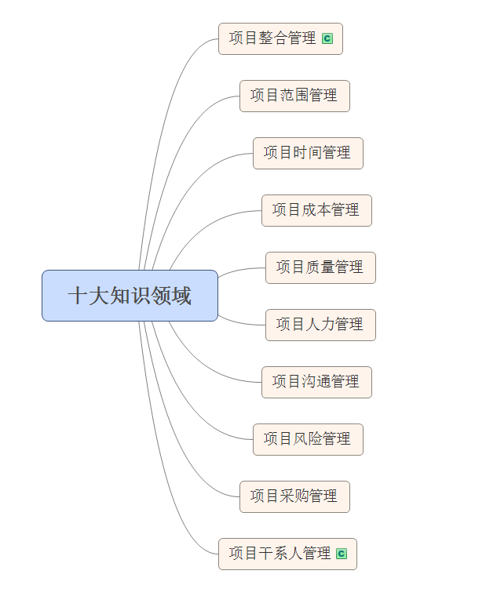
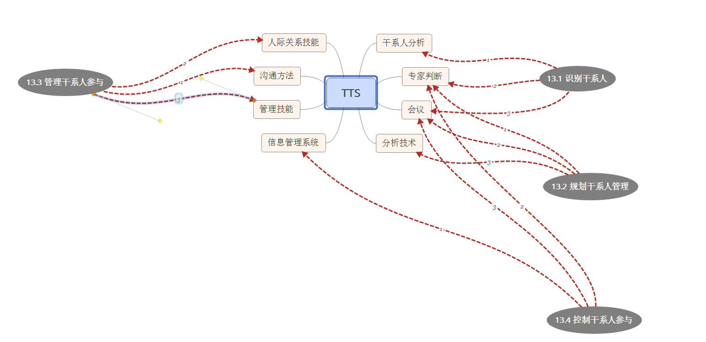
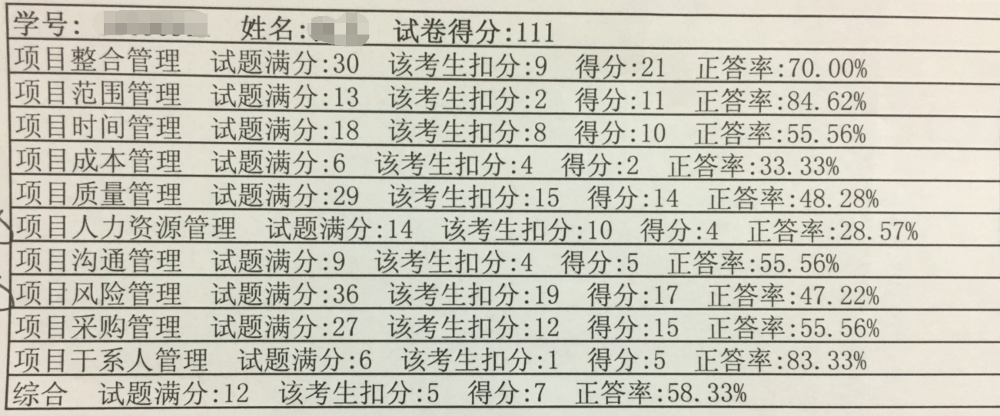
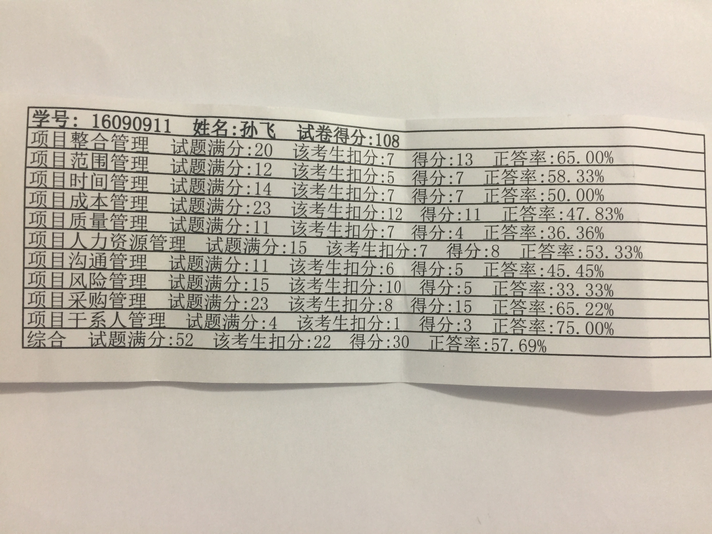

# PMP 考试知识点总结

* 在准备PMP考试过程中，所学习有关项目管理的知识点。
* 模拟考试相关知识点的总结。

希望可以减轻大家备考压力。  
PS:我也在备考阶段，此项目每天都会更新。思维导图使用 *XMind* 绘制。  

## 组织对项目管理的影响

## 项目管理过程组（五大过程组）简介

## 十大知识领域

## 工具集合【正在更新】

---

## 2016.10.15 一模考试

## 2016.11.19 二模考试

## 2016.11.27 三模考试

135分！！！

---

PMP认证考试已过,成绩还可以，*PPMMB* :smile: :smile: :smile:
